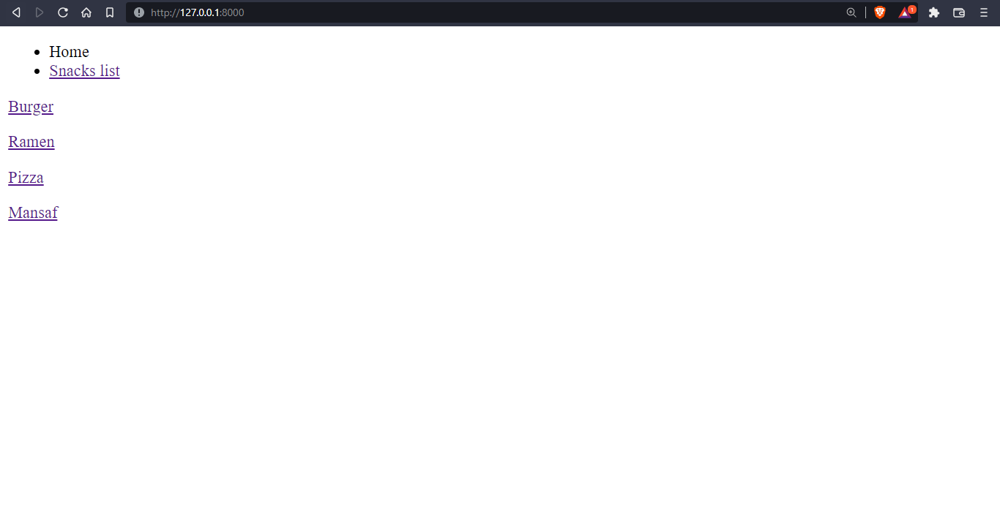
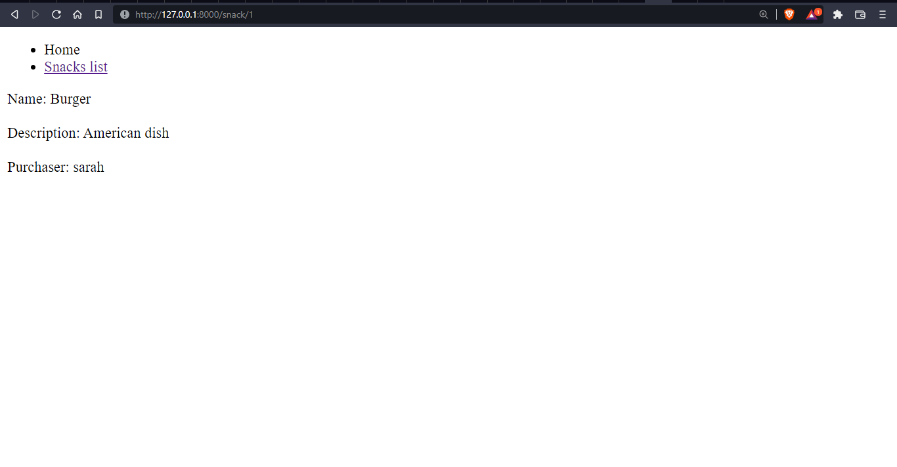
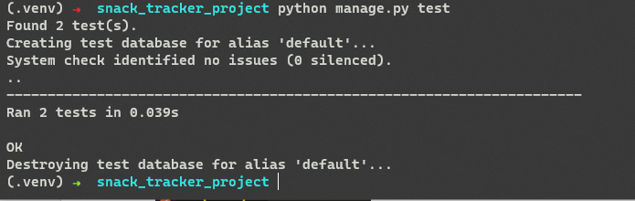

# Django Snacks
Author: Sarah Hudaib

## Challenge
build out a project with one model and wire up that model using Django Views

## Architecture
Python 3.9.5
Django 4.0.4

## Verifications

### - Snack-List Page

### - Snack-Detail Page

### - Test
